# Organic Design Patterns

**Organic Design Patterns** is a portfolio-level ASP.NET Core project built to demonstrate enterprise design patterns through a real organic e-commerce scenario.

The project combines **Clean Architecture**, **ASP.NET Core Web API**, **ASP.NET Core MVC**, **CQRS**, **MediatR**, **Entity Framework Core**, **Repository Pattern**, **Unit of Work**, and multiple behavioral/creational/structural design patterns inside a practical shopping flow.

---

## Project Overview

This project is not only a basic design pattern sample.
It includes a complete demo flow from public product listing to basket, checkout, order creation, admin order management and interactive pattern testing.

Main purpose of the project:

* Demonstrate design patterns with real business scenarios
* Build a clean layered architecture
* Separate Web API and MVC Web UI responsibilities
* Show how design patterns can be connected to e-commerce operations
* Provide a premium admin panel for managing pattern scenarios and demo orders

---

## Technologies Used

* ASP.NET Core MVC
* ASP.NET Core Web API
* .NET 8
* Entity Framework Core
* SQL Server
* MediatR
* CQRS
* FluentValidation
* Repository Pattern
* Unit of Work
* AutoMapper
* Bootstrap
* JavaScript
* Swagger / OpenAPI

---

## Architecture

The solution follows a clean layered architecture.

```txt
OrganicDesignPatterns
│
├── OrganicDesignPatterns.Domain
│   ├── Entities
│   ├── Enums
│   └── Common
│
├── OrganicDesignPatterns.Application
│   ├── DTOs
│   ├── Features
│   ├── DesignPatterns
│   ├── Behaviors
│   ├── Validators
│   └── Interfaces
│
├── OrganicDesignPatterns.Persistence
│   ├── Context
│   ├── Repositories
│   ├── UnitOfWork
│   └── Configurations
│
├── OrganicDesignPatterns.Infrastructure
│
├── OrganicDesignPatterns.WebAPI
│   ├── Controllers
│   └── Swagger
│
└── OrganicDesignPatterns.WebUI
    ├── Controllers
    ├── Areas/Admin
    ├── Views
    ├── Models
    ├── Data
    └── wwwroot
```

---

## Implemented Design Patterns

| Pattern                 | Scenario                                         |
| ----------------------- | ------------------------------------------------ |
| Strategy Pattern        | Dynamic discount calculation                     |
| Decorator Pattern       | Shipping cost calculation with optional services |
| Factory Method          | Order status based mail template generation      |
| Observer Pattern        | Order approval event triggering multiple actions |
| Chain of Responsibility | Order validation flow                            |
| Repository Pattern      | Data access abstraction                          |
| Unit of Work            | Transaction management                           |

---

## Business Scenario

The project uses an organic e-commerce concept to make design patterns easier to understand.

The public side includes:

* Home page
* Product showcase
* Category showcase
* Basket flow
* Checkout flow
* Order success page
* Interactive Pattern Lab

The admin side includes:

* Premium admin dashboard
* Pattern demo management page
* Demo order management
* Order detail page
* Pattern execution explanation
* Admin navigation badges

---

## Demo E-Commerce Flow

```txt
Products
→ Add to Basket
→ Basket
→ Checkout
→ Demo Order Created
→ Admin Orders
→ Order Detail
→ Approve / Cancel
```

This flow demonstrates how e-commerce actions can be connected with design patterns such as Observer, Factory Method and Chain of Responsibility.

---

## Web API Endpoints

The Web API exposes endpoints for products, categories and design pattern scenarios.

Example endpoints:

```txt
GET     /api/Categories
POST    /api/Categories
PUT     /api/Categories
DELETE  /api/Categories/{id}

GET     /api/Products
POST    /api/Products
PUT     /api/Products
DELETE  /api/Products/{id}

POST    /api/Discounts/calculate
POST    /api/Shipping/calculate
POST    /api/MailTemplates/generate
POST    /api/OrderEvents/approve
POST    /api/OrderValidation/validate
```

Swagger URL:

```txt
https://localhost:7225/swagger/index.html
```

---

## Screenshots

### Home Page

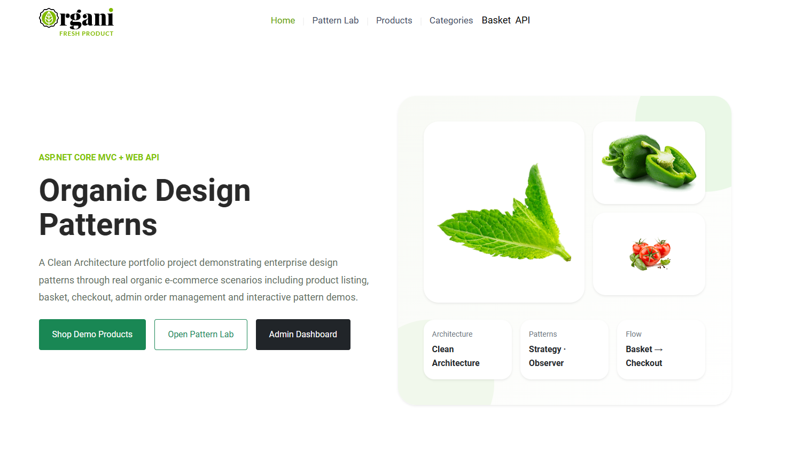

---

### Products Page

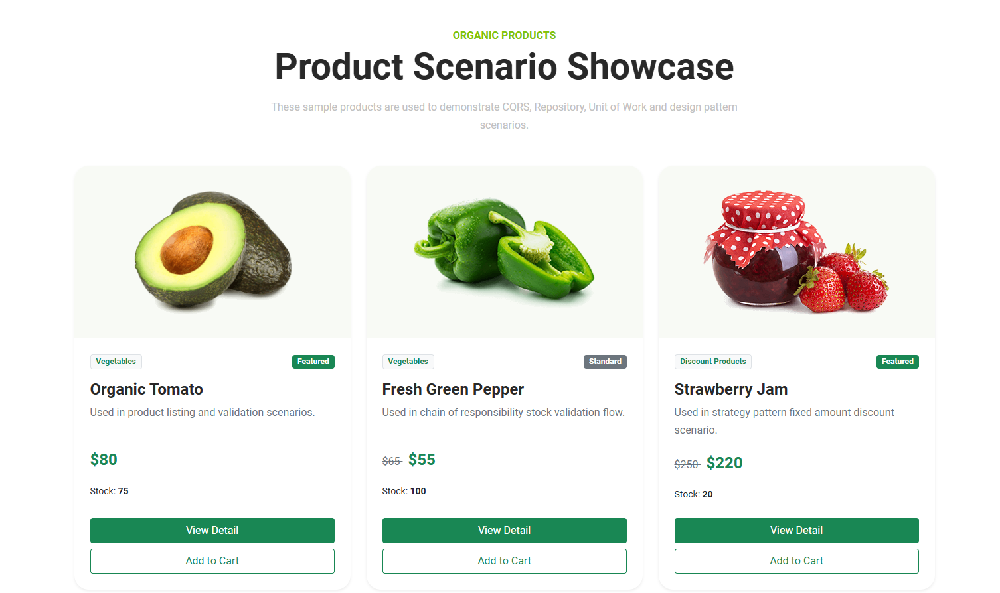

---

### Categories Page

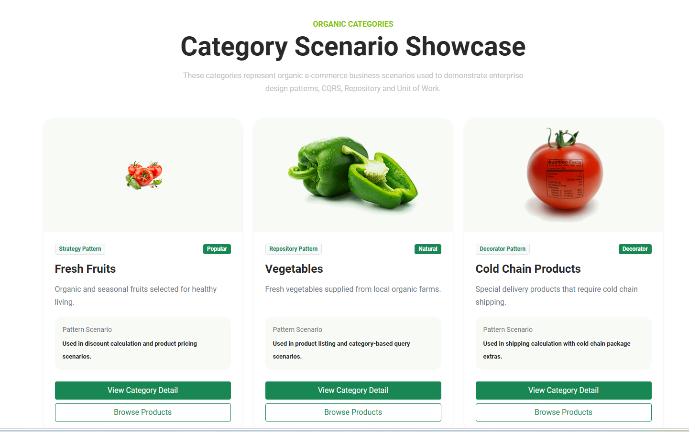

---

### Category Detail

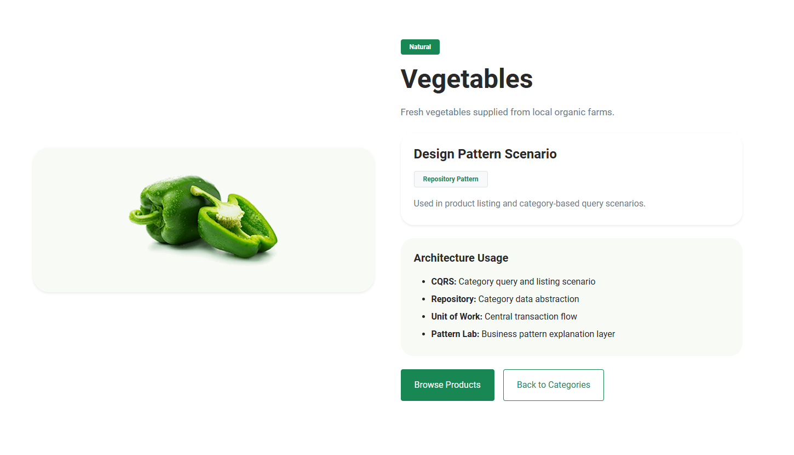

---

### Basket Page

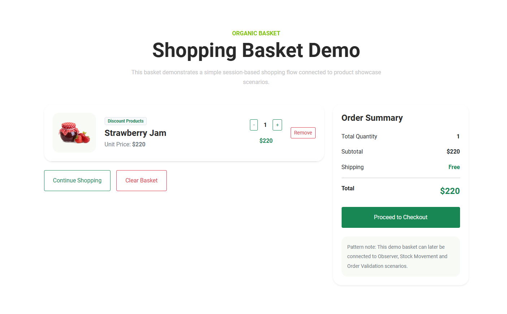

---

### Checkout Page

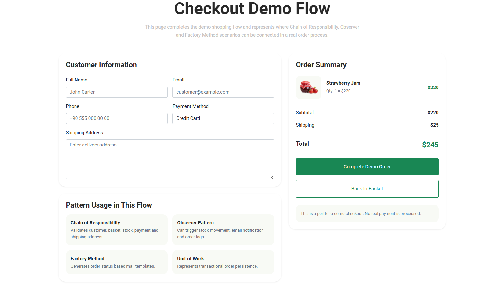

---

### Order Success

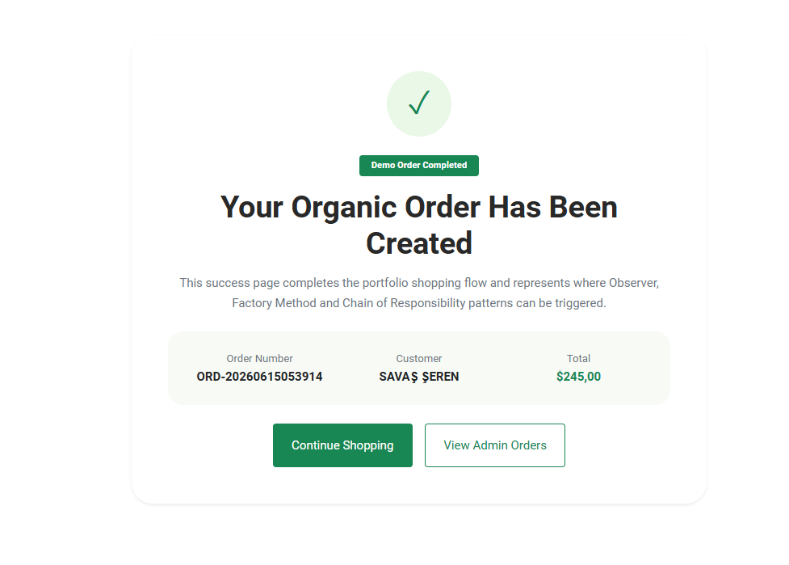

---

### Admin Dashboard

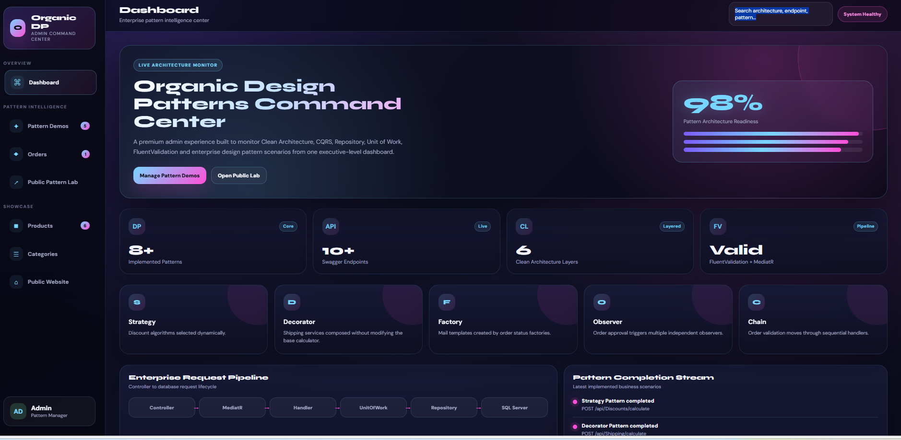

---

### Admin Pattern Demos

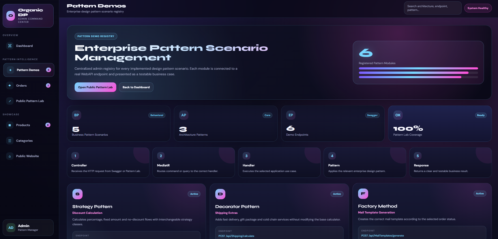

---

### Admin Orders

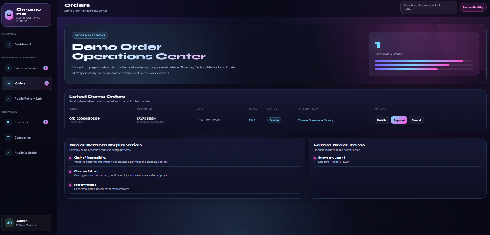

---

### Admin Order Detail

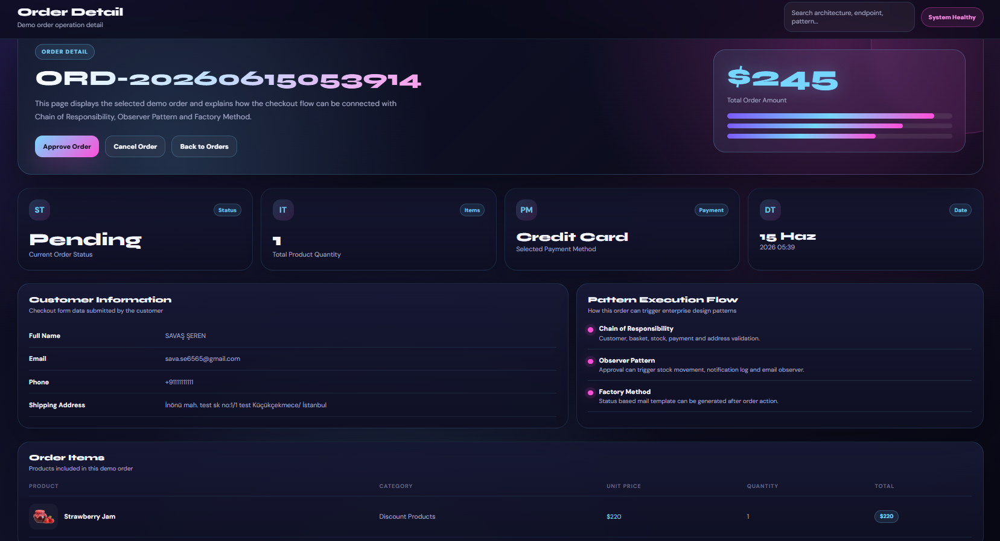

---

### Pattern Lab

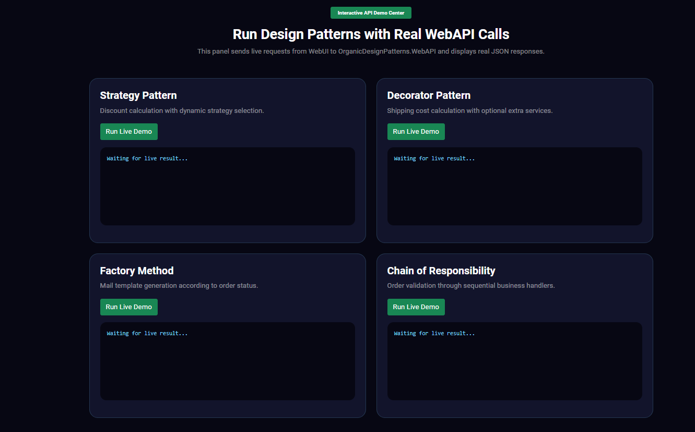

---

### Swagger Endpoints

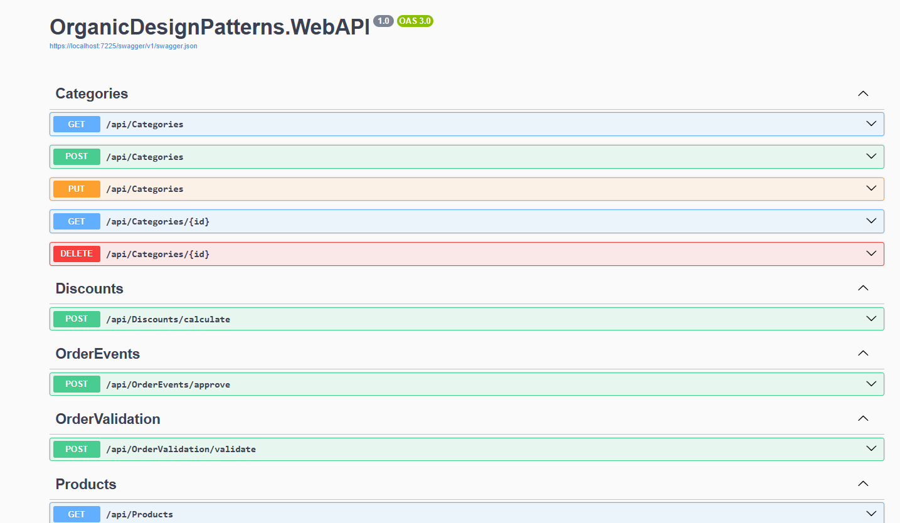

---

## Admin Panel Features

The admin panel was designed as a premium command center.

Admin features:

* Dashboard overview
* Pattern demo registry
* Demo order management
* Order detail page
* Approve and cancel demo orders
* Pattern execution explanation
* Sidebar navigation badges
* Premium dark UI design

---

## Pattern Lab

The Pattern Lab page is an interactive demo center.

It allows testing design pattern scenarios from the Web UI side and shows how the MVC project can communicate with the Web API.

Pattern Lab includes:

* Strategy Pattern demo
* Decorator Pattern demo
* Factory Method demo
* Chain of Responsibility demo

---

## Database

The project uses SQL Server with Entity Framework Core.

Main entities include:

* Product
* Category
* Customer
* Basket
* BasketItem
* Order
* OrderDetail
* Discount
* NotificationLog
* StockMovement
* ShippingOption

---

## How to Run

### 1. Clone the repository

```bash
git clone https://github.com/SavashSheren/OrganicDesignPatterns.git
```

### 2. Open the solution

Open the solution with Visual Studio.

### 3. Update the connection string

In `OrganicDesignPatterns.WebAPI/appsettings.json`, update the SQL Server connection string:

```json
{
  "ConnectionStrings": {
    "DefaultConnection": "Server=YOUR_SERVER;Database=OrganicDesignPatternsDb;Trusted_Connection=True;TrustServerCertificate=True;"
  }
}
```

### 4. Apply migrations

Open Package Manager Console and run:

```bash
Update-Database
```

### 5. Run both projects

Run these projects together:

```txt
OrganicDesignPatterns.WebAPI
OrganicDesignPatterns.WebUI
```

Default local URLs:

```txt
Web UI:
https://localhost:7019

Web API Swagger:
https://localhost:7225/swagger/index.html
```

---

## Why This Project Is Different

This project is different from a classic design pattern example because it connects patterns to realistic business actions.

Instead of showing patterns only with simple console examples, it demonstrates them inside:

* Product listing
* Category management
* Discount calculation
* Shipping calculation
* Basket flow
* Checkout flow
* Order approval
* Notification scenarios
* Admin order management
* Web API endpoints

This makes the project more understandable, practical and portfolio-ready.

---

## Project Purpose

This project was developed as a portfolio project to demonstrate:

* Clean Architecture knowledge
* ASP.NET Core MVC and Web API usage
* Design pattern implementation
* CQRS and MediatR structure
* Repository and Unit of Work usage
* Admin panel development
* Practical e-commerce workflow design

---

## Developer

**Savaş Şeren**

GitHub: [SavashSheren](https://github.com/SavashSheren)

---

## License

This project is developed for educational and portfolio purposes.
